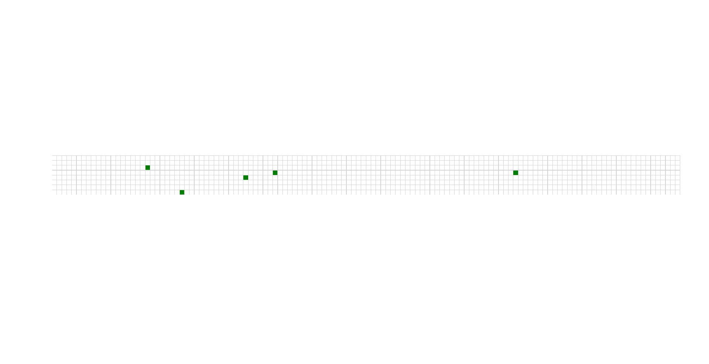

# Advent of Code
This repo contains the solutions to the problems from [advent of code](https://adventofcode.com/2020)

---

## --- Day 1: Report Repair ---
[Solution!](./01/solution.py)

### Input 
The input for this day is simply a file with integers, seperated by a newline(`\n`).

f.eks.
```
1721
979
366
299
675
1456
```

I used a list comprehension to read the lines and store the integers in an array
``` python
numbers = [int(l.strip()) for l in open("input.txt")]
```

### Part 1
To solve this part I used `itertools.combinations`. this functions allows us to generate r length subsequences of elements from the input iterable. This means we can pass in the `numbers` and set the `r` parameter to `2` and get all the combinations with two elements.
```python
combinations = itertools.combinations(numbers, 2)
```

The next part is to simply iterate through these combinations and look for the combinations where the sum is equal to `2020` and return the product.
```python
part1_ans = [reduce(mul, c) for c in combinations if sum(c) == 2020]
```
Even though this would create a list with all the combinations where the sum is `2020` the length of the list should only be `1` element if the input data is correct.

### Part 2
For part 2 of this day we only have to change one single character. Instead of combinations of length `2` we want combinations with length `3`. This is simply done by changing the `r` argument of `combinations` 
```python
combinations = itertools.combinations(numbers, 3)
```


---


## --- Day 2: Password Philosophy ---
[Solution!](./02/solution.py)

### Input 
The second day input is a bit more complicated than the first one. The input for day `2` consist of mutiple lines, where each line contains a integer range, a character, and a string.
F.eks.

```
1-3 a: abcde
1-3 b: cdefg
2-9 c: ccccccccc
```

The first this I did was to read the entire input as a string.
```python
s = open("input.txt").read()
```

After this I used a simple regex to modify each line in the input.
```python
s = re.sub(r"-|:", " ", read_string("input.txt"))
# 1-3 a: abcde -> 1 3 a abcde
```
This is done to make it easier to split each line and extract the information. Now I can simply use `split()` to end up with something like:
```
["1", "3", "a", "abcde"]
```

### Part 1
The sultion for this task is very simple. After the input parsing I have an array of arrays, where each sub-array is on the format: `[start, end, character, string]`.

- Step 1: Iterate through the lines
`for s,e,c,s in all_lines:`
- Step 2: Get the count for `letter` in the string
`if s.count(c): result += 1`
- Step 3: Check if count is in the range `start-end`, if yes update result

This can all be done in a single list comprehension:
```python
return sum([s.count(c) in range(int(s), int(e)+1) for s,e,c,s in all_lines])
```

### Part 2
In part 2 we are suppose to check if the character `c` appears on either index `s` or index `e` in the string `s`. The password is valid if the chracter appears on at least, and only one of the indexes. In other words this can be expressed as a `XOR` opperation.

| s | e | valid |
|:-:|:-:|:-----:|
| 0 | 0 |   0   |
| 1 | 0 |   1   |
| 0 | 1 |   1   |
| 1 | 1 |   0   |


```python
return sum([(p[int(s)-1]==c) ^ (p[int(e)-1]==c) for s,e,c,s in all_lines])
```


---


## --- Day 3: Toboggan Trajectory ---
[Solution!](./03/solution.py)

### Input
The input for this task consist of mutiple lines of strings. Each character in a line is either a `#` or a  `.`. All the lines together make up a grid, where `#` represents a tree and `.` represents an empty space. See example under.

```
..##.......
#...#...#..
.#....#..#.
..#.#...#.#
.#...##..#.
..#.##.....
.#.#.#....#
.#........#
#.##...#...
#...##....#
.#..#...#.#
```

I chose a 2D array representation of the grid. To acheive this, i simply read every line, and split each of the strings into char arrays.

```python
[[c for c in s.strip()] for s in open("input.txt")]
```

### Part 1
In this part we are suppose to get the number of trees we hit if we travel through the grid in a certain direction. In this case the direction is `delta x = 3, delta y = 1`. The starting position is `x = 0, y = 0`. This means for every iteration the new position is: `current_pos + deltas`

The code:
```python
H, W = len(grid), len(grid[0])
dx = 3
dy = 1
return sum(grid[i * dy][(i * dx) % W] == "#" for i in range(H // dy))
```

Lets break down the code.
- `i * delta` will get the position on `x` and `y` after i steps
- `% W` in the x-axis is to ensure we loop around to the start when out of bounds
- `range(H // dy)` will loop the number of steps to reach the bottom `y`


### Part 2
For part 2 this day we should simply do the same, but for multiple paths down the grid. We should then multiply the results from each of the paths

We simply add another loop, looping over the different paths, and use `reduce` to multiply the results together.

```python
H, W = len(grid), len(grid[0])
dirs = [(1,1),(3,1),(5,1),(7,1),(1,2)]
return reduce(mul, [sum(grid[i * dy][(i * dx) % W] == "#" for i in range(H // dy)) for dx, dy in dirs])
```


---


## --- Day 4: Passport Processing ---
[Solution!](./04/solution.py)

### Input
The input for this day is a lot of passports and their information. Each passport is separated by a line with an empty newline(`\n`). For each passport there are a lot of fields with information. A field is represented as: `key:value` in the string.

Example input:
```
ecl:gry pid:860033327 eyr:2020 hcl:#fffffd
byr:1937 iyr:2017 cid:147 hgt:183cm

iyr:2013 ecl:amb cid:350 eyr:2023 pid:028048884
hcl:#cfa07d byr:1929

hcl:#ae17e1 iyr:2013
eyr:2024
ecl:brn pid:760753108 byr:1931
hgt:179cm

hcl:#cfa07d eyr:2025 pid:166559648
iyr:2011 ecl:brn hgt:59in
```

As we can see fields within the same passport can be on different lines as well. To make it a bit easier I simplified the input using some regex in the beginning.
```python
text = open("input.txt").read()
text = re.sub(r"(.)\n", r"\1 ", text)
```
After this regex substitution the input looks like this: 

```
ecl:gry pid:860033327 eyr:2020 hcl:#fffffd byr:1937 iyr:2017 cid:147 hgt:183cm
iyr:2013 ecl:amb cid:350 eyr:2023 pid:028048884 hcl:#cfa07d byr:1929
hcl:#ae17e1 iyr:2013 eyr:2024 ecl:brn pid:760753108 byr:1931 hgt:179cm
hcl:#cfa07d eyr:2025 pid:166559648 iyr:2011 ecl:brn hgt:59in
```

Each of the lines now represents a full passport.
The next step was to iterate through the lines and store all the passports. For each passport I created a dictionary with all its entries, and appended this to a list.
```python
lines = [[tuple(s.split(":")) for s in l.split()] for l in text.split("\n")]
passwords = [{k: v for k, v in l} for l in lines]
```

After this the `passsports` variable is a list with dictionaries.

### Part 1
After creating the solid datastructure this part was really easy. All i had to do here was to iterate through the passports, and check the length of each dict. There are 2 cases where a passport is valid; all fields are there, or `cid` is missing. This simple check takes care of that.

```python
def is_valid_1(p):
    return len(p) == 8 or len(p.keys()) == 7 and "cid" not in p.keys()
```

After defining this function we can simply do:
```python
sum(is_valid_1(p) for p in passports)
```


### Part 2
In this part the criteria for a valid passport is more strict. In addition to the requirements from part 1 there are some extra ones for each field. here is a list of requirements:

- `byr` (Birth Year) - four digits; at least `1920` and at most `2002`.
- `iyr` (Issue Year) - four digits; at least `2010` and at most `2020`.
- `eyr` (Expiration Year) - four digits; at least `2020` and at most `2030`.
- `hgt` (Height) - a number followed by either `cm` or `in`:
    - If `cm`, the number must be at least `150` and at most `193`.
    - If `in`, the number must be at least `59` and at most `76`.
    `hcl` (Hair Color) - a # followed by exactly six characters `0-9 or a-f`.
- `ecl` (Eye Color) - exactly one of: `amb` `blu` `brn` `gry` `grn` `hzl` `oth`.
- `pid` (Passport ID) - a nine-digit number, including leading zeroes.
- `cid` (Country ID) - ignored, missing or not.

There are basically 3 different categories of check that are suitable in my opinion.
1. A range - `byr`, `iyr` and `eyr` 
2. String mathing - `hgt`, `pid` and `hcl`
3. Sub-set `ecl`

- The range matching is done using regex on the form:
```python
min_range <= passport[key] <= max_range
```
- The string matching is done using regex
```python
re.match(regex, passport[key])
```
- The sub-set matching is done simply with
```python
passport[key] in some_defined_values
```

Each regex I used for `hgt`, `pid` and `hcl` is listed under:
- `hgt` : `(^(1[5-8]\d|19[0-3])cm$|^(([5-6]\d|7[0-6])in)$)`
- `pid` : `^\d{9}$`
- `hcl` : `^#[\d|a-f]{6}$`

---


## --- Day 5: Passport Processing ---
[Solution!](./05/solution.py)

### Part 1
- Find the seat ID with the highest possible ID

### Part 2
- Find "your" seat. The seat that is missing from the data. (not at the beginning or end)



---


## --- Day 6: Custom Customs ---
[Solution!](./06/solution.py)

### Part 1
- Find the number of questions anyone answered "yes" to in each group, and get sum of all groups

### Part 2
- Get the number of questions everyone in the group answered yes to. And return sum of sums

---
